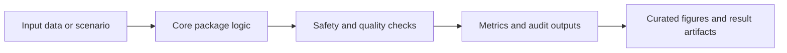

# TRI-X

## Overview

Framework-level TRI-X package for triage, TiTrATE reasoning, safety governance, and transparent decision support.

This repository is part of an eight-repository clinical decision-support research portfolio. Current status: manuscript or component package in preparation. The repository role is **manuscript**.

## Standard Repository Layout

| Path | Purpose |
|---|---|
| `src/` | Package source code: `trix` |
| `tests/` | Unit, smoke, and behavior checks |
| `scripts/` | Reproducibility and export scripts |
| `examples/` | Runnable examples and demonstrations |
| `figures/`, `visualizations/`, `outputs/`, `results/` | Generated visual and result artifacts |
| `data/`, `models/`, `evaluation/` | Dataset, model, and evaluation assets when used by this repo |
| `FIGURE_MANIFEST.csv` | Curated figure inventory for manuscript or component evidence |
| `pyproject.toml`, `setup.py`, `requirements.txt`, `pytest.ini` | Python package and test configuration |

## Architecture Flow



## Core Logic

- Estimate triage risk.
- Apply TiTrATE dizziness reasoning.
- Apply safety governance and audit logic.
- Export framework and performance panels.

## Key Formulas And Rules

- TRI-X decision: D = f(Triage, TiTrATE, SRGL, XAI)
- Risk gate: action = escalate if risk >= theta_high else monitor
- Validation target: pass if metric >= target and governance constraints hold

## Data, Results, Charts, And Graphs

The curated visual set is controlled by FIGURE_MANIFEST.csv and lists **4** figure entries, all rendered from computed `results/` (no hardcoded numbers).

| ID | Role | PNG | PDF |
|---|---|---|---|
| TRIX-F1 | results | `figures/manuscript/fig1_diagnostic_accuracy.png` | `figures/manuscript/fig1_diagnostic_accuracy.pdf` |
| TRIX-F2 | results | `figures/manuscript/fig2_critical_scenario.png` | `figures/manuscript/fig2_critical_scenario.pdf` |
| TRIX-F3 | results | `figures/manuscript/fig3_shap_importance.png` | `figures/manuscript/fig3_shap_importance.pdf` |
| TRIX-F4 | data | `figures/manuscript/fig4_cohort_distribution.png` | `figures/manuscript/fig4_cohort_distribution.pdf` |

## Reproduce

```powershell
cd D:\PhD-NU\Manuscript\GitHub\TRI-X
python -m venv .venv
.\.venv\Scripts\Activate.ps1
pip install -e .
pip install -r requirements.txt
python scripts/run_all.py                      # compute results/ (seed = 42)
python scripts/generate_manuscript_figures.py  # render figures from results/
python scripts/run_validation.py               # convenience: run_all + figures
python -m pytest -q                            # unit + determinism tests
```

All reported metrics are computed on a **synthetic** cohort by `scripts/run_all.py`
(seed = 42) and reproduce byte-for-byte. See `REPRODUCIBILITY.md` for the full
claim-by-claim mapping. No real patient data and no human ratings are used.

## Verification Criteria

- Root metadata and package files are present.
- Source paths follow `src/<package>/...` where the package shape allows it.
- Tests pass with `python -m pytest -q`.
- Curated figures are listed in `FIGURE_MANIFEST.csv` rather than inferred from every raw image file.
- Manuscript status wording stays conservative: in preparation, implementation, supplementary, or reproducibility/component evidence as appropriate.
- No local manuscript path, external assistant wording, or software metadata block is kept in the repository text.

## Portfolio Relationship

| Repository | Role |
|---|---|
| BASICS-CDSS | Beyond-accuracy evaluation methodology |
| TRI-X | Framework-level package |
| ORASR | Routing and safety-action component |
| DRAS-5 | Dynamic risk-state component |
| SAFE-Gate | Safety-gated ensemble framework |
| SynDX | Synthetic validation and explainability evidence |
| SURgul | SRGL/governance reproducibility component |
| TRI-X-CDSS | Integration and implementation package |
| Selective-CDSS | Risk-controlled selective-prediction (abstention) component |
| Causal-CDSS | Causal-inference evaluation component |
| Beyond-Accuracy | Simulation-based safety/calibration evaluation framework |

## Contact

**Chatchai Tritham**  
Department of Computer Science and Information Technology, Faculty of Science, Naresuan University, Phitsanulok 65000, Thailand  
Email: chatchait66@nu.ac.th  
ORCID: 0000-0001-7899-228X

**Chakkrit Snae Namahoot**  
Department of Computer Science and Information Technology, Faculty of Science, Naresuan University, Phitsanulok 65000, Thailand  
Email: chakkrits@nu.ac.th  
ORCID: 0000-0003-4660-4590